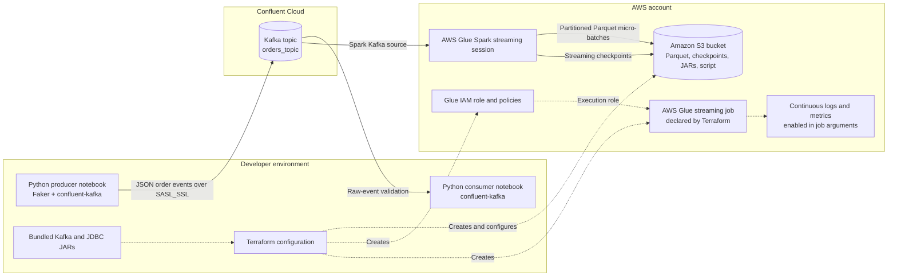
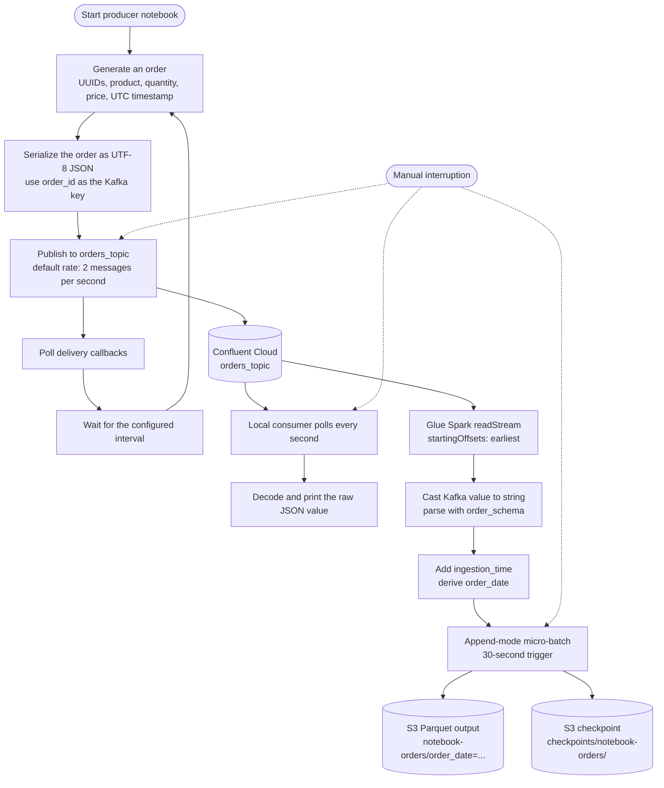

# AWS Kafka Streaming Pipeline

A small, notebook-based demonstration of a near-real-time order pipeline. A Python  
producer generates synthetic order events and sends them to a Confluent Cloud  
Kafka topic. The same topic can be inspected by a local Python consumer or read  
by an AWS Glue Spark streaming session, which parses the JSON events and writes  
partitioned Parquet files to Amazon S3.

> \[!IMPORTANT\]  
> This repository is a learning/demo project, not a deployment-ready production  
> system. Read **Security warning** and **Known gaps** before running it.

## Demo video

[](https://youtu.be/J-rmk5qVtUQ)

The linked video demonstrates the producer, Confluent Cloud topic, local  
consumer, AWS Glue streaming ETL, and date-partitioned Parquet output in S3.  
Where the video and the current repository differ, this README treats the  
repository's `main` branch as the canonical implementation. See  
[Video-to-repository differences](#video-to-repository-differences).

## What this project demonstrates

-   Generating fake order records with `Faker` in  
    [`streaming_data_producer.ipynb`](streaming_data_producer.ipynb).
-   Publishing JSON messages to the `orders_topic` Kafka topic with  
    `confluent-kafka`, SASL/PLAIN authentication, and TLS (`SASL_SSL`).
-   Reading and printing raw Kafka messages locally with  
    [`streaming_data_consumer.ipynb`](streaming_data_consumer.ipynb).
-   Reading Kafka with Spark Structured Streaming in AWS Glue, parsing an explicit  
    order schema, and adding `ingestion_time` and `order_date` columns in  
    [`StreamingETLPipeline.ipynb`](StreamingETLPipeline.ipynb).
-   Writing append-only Parquet micro-batches to S3 every 30 seconds, partitioned  
    by `order_date`, with a separate S3 checkpoint location.
-   Describing part of the AWS infrastructure with Terraform in  
    [`terraform/`](terraform/), including an S3 bucket, public-access blocking, a  
    Glue IAM role and policies, bundled JAR uploads, and a Glue streaming job.

## Architecture

The solid arrows below represent the runtime paths implemented in the  
notebooks. Dashed arrows show infrastructure that the Terraform configuration  
_intends_ to create; the current Terraform path is blocked by a missing file,  
as explained under [Known gaps](#known-gaps).



### Component responsibilities

| Component | Source | Responsibility |
| --- | --- | --- |
| Synthetic producer | [`streaming_data_producer.ipynb`](streaming_data_producer.ipynb) | Generates fake orders continuously and publishes them to Kafka. |
| Kafka topic | Configured as `orders_topic` in all three notebooks | Buffers and distributes the JSON order stream. The Kafka cluster and topic are **not** created by this repository's Terraform. |
| Local consumer | [`streaming_data_consumer.ipynb`](streaming_data_consumer.ipynb) | Polls the topic as `user-consumer-group` and prints decoded message values for validation. |
| Glue streaming ETL | [`StreamingETLPipeline.ipynb`](StreamingETLPipeline.ipynb) | Reads Kafka, parses JSON with a Spark schema, adds audit/partition columns, and writes Parquet to S3. |
| S3 | Notebook paths and [`terraform/main.tf`](terraform/main.tf) | Stores Parquet output and checkpoints; Terraform also intends to store JARs and a Glue job script. |
| Terraform | [`terraform/`](terraform/) | Declares the S3 bucket, Glue role/policies, JAR uploads, and a Glue 5.0 streaming job. It is not currently applicable because its job script is absent. |

## End-to-end workflow and data flow



## Event schema

The producer and Glue notebook use the same six input fields. Glue adds two  
columns after parsing.

| Field | Producer value | Glue type | Added by Glue? |
| --- | --- | --: | :-: |
| `order_id` | Faker UUID string | `StringType` | No |
| `customer_id` | Faker UUID string | `StringType` | No |
| `product` | Random item from the notebook's `PRODUCTS` list | `StringType` | No |
| `quantity` | Random integer from 1 through 5 | `IntegerType` | No |
| `price` | Random value from 9.99 through 2499.99, rounded to two decimals | `DoubleType` | No |
| `order_timestamp` | Current UTC timestamp in ISO format | `TimestampType` | No |
| `ingestion_time` | Spark `current_timestamp()` | Spark timestamp | Yes |
| `order_date` | Date derived from `order_timestamp` | Spark date | Yes |

The producer uses `order_id` as the Kafka message key and JSON-encodes the full  
record as the message value.

## Repository layout

```text
.
├── StreamingETLPipeline.ipynb        # AWS Glue Spark streaming notebook
├── streaming_data_producer.ipynb     # Faker-based Kafka producer
├── streaming_data_consumer.ipynb     # Local Kafka validation consumer
├── jars/
│   ├── kafka-clients-3.3.1.jar
│   ├── redshift-jdbc42-2.1.0.12.jar
│   ├── spark-sql-kafka-0-10_2.12-3.3.0.jar
│   └── spark-token-provider-kafka-0-10_2.12-3.3.0.jar
└── terraform/
    ├── main.tf                        # AWS resources and object uploads
    ├── variables.tf                   # Region, bucket, role, and job inputs
    └── outputs.tf                     # Bucket, role ARN, and Glue job outputs
```

There is no committed `README`, package lock file, Python requirements file,  
test suite, CI workflow, or license file in the analyzed branch.

## Prerequisites

The repository does not declare a complete, reproducible toolchain. The  
following requirements are directly implied by the checked-in notebooks and  
Terraform files; versions are shown only where the repository specifies them.

| Requirement | Repository evidence |
| --- | --- |
| A Jupyter-compatible Python environment | The executable project files are `.ipynb` notebooks. No Python version is declared. |
| `confluent-kafka` and `faker` | The producer notebook installs these packages. Its saved output shows `confluent-kafka` 2.15.0 and `faker` 40.31.0, but the install command does not pin them. |
| A reachable Kafka cluster, topic, and SASL credentials | All notebooks connect to a Confluent Cloud bootstrap server and `orders_topic`; neither is provisioned by Terraform. |
| AWS Glue Studio Interactive Sessions | `StreamingETLPipeline.ipynb` uses Glue magics and `awsglue`/PySpark imports. |
| An S3 bucket matching the notebook paths | The current ETL notebook writes to `s3://orders-realtime-bucket/...`. |
| Terraform `>= 1.0` for the IaC path | Declared in `terraform/main.tf`; AWS provider is `~> 5.0` and random provider is `~> 3.0`. |

### Bundled JARs

The `jars/` directory includes four binaries. The Glue notebook's  
`%extra_jars` cell explicitly loads only:

-   `spark-sql-kafka-0-10_2.12-3.3.0.jar`
-   `kafka-clients-3.3.1.jar`

Terraform's `fileset` expression would upload all four JARs and pass all of  
them to the declared Glue job. The Redshift JDBC JAR is not used by the current  
notebook code, and the token-provider JAR is not listed in its `%extra_jars`  
cell.

## Security warning

> \[!CAUTION\]  
> The committed notebooks contain plaintext Kafka API credentials. Do **not**  
> reuse or publish those values. Treat them as compromised: revoke/rotate them  
> in Confluent Cloud before running this project, remove them from the notebooks  
> and notebook outputs, and use newly issued credentials through an appropriate  
> secret-management mechanism.

The producer already reads the following environment variables, but its  
committed fallback values include credentials and should be removed. The local  
consumer and Glue notebook currently use hardcoded values and do **not** read  
these environment variables without code changes.

| Variable | Used by producer | Non-sensitive default in source |
| --- | :-: | --- |
| `KAFKA_BROKERS` | Yes | A committed Confluent Cloud bootstrap address |
| `KAFKA_TOPIC` | Yes | `orders_topic` |
| `KAFKA_API_KEY` | Yes | **Sensitive value is embedded; rotate and remove it** |
| `KAFKA_API_SECRET` | Yes | **Sensitive value is embedded; rotate and remove it** |
| `RATE_PER_SEC` | Yes | `2.0` |

For a temporary local producer session, set every producer option explicitly so  
that the code does not rely on committed credential fallbacks:

```bash
export KAFKA_BROKERS="<your-bootstrap-server:9092>"
export KAFKA_TOPIC="orders_topic"
export KAFKA_API_KEY="<your-rotated-api-key>"
export KAFKA_API_SECRET="<your-rotated-api-secret>"
export RATE_PER_SEC="2.0"
```

Do not commit shell history, `.env` files, Terraform variable files, notebook  
outputs, or other files containing credentials. The existing `.gitignore`  
ignores `*.tfvars` and Terraform state, but it does not list `.env`.

## Run the notebook demonstration

The repository does not provide a single automated startup command. Use the  
notebooks in the following order after rotating the exposed credentials and  
providing safe replacements.

### 1\. Clone the repository

```bash
git clone https://github.com/ArivoliRajan/AWS_kafka_streaming_pipeline.git
cd AWS_kafka_streaming_pipeline
```

### 2\. Prepare Confluent Cloud

Create or select a Kafka cluster, create the `orders_topic` topic, and create  
credentials authorized to produce and consume that topic. This setup is  
external to the repository: the Terraform files create AWS resources only.

Update the notebook configuration to point to your cluster. The producer can  
use the environment variables listed above. The consumer and Glue notebooks  
must be changed to avoid their committed hardcoded credentials before they are  
run.

### 3\. Start the producer

Open [`streaming_data_producer.ipynb`](streaming_data_producer.ipynb) in your  
Jupyter-compatible environment. Its first cell installs the two local Python  
packages:

```python
pip install confluent-kafka faker
```

Run the configuration/code cell. It calls `main()` and continues producing  
orders until you interrupt it. The configured default rate is two messages per  
second.

### 4\. Validate with the local consumer

Open [`streaming_data_consumer.ipynb`](streaming_data_consumer.ipynb), replace  
its hardcoded connection values with your rotated credentials, and run its  
cells in order. It subscribes as `user-consumer-group`, starts at `latest` when  
that group has no committed offset, polls once per second, and prints decoded  
message values until interrupted.

The consumer imports `KafkaException` only indirectly in its error path: its  
notebook imports `Consumer` and `KafkaError`, but not `KafkaException`. If a  
non-EOF Kafka error occurs, that path can raise `NameError` rather than the  
intended Kafka exception.

### 5\. Run the Glue streaming notebook

Use [`StreamingETLPipeline.ipynb`](StreamingETLPipeline.ipynb) in AWS Glue  
Studio Interactive Sessions.

The committed notebook requests:

-   Glue version `5.1`
-   `G.1X` workers
-   five workers
-   an idle timeout of 2,880 minutes
-   the Spark Kafka SQL 3.3.0 and Kafka clients 3.3.1 JARs from  
    `s3://orders-realtime-bucket/jars/`

Before starting a session:

1.  Rotate and replace the hardcoded Kafka credentials safely.
2.  Ensure the two JARs exist at the exact S3 paths used by `%extra_jars`, or  
    update those paths.
3.  Ensure the Glue execution role can read the JARs and read/write the output  
    and checkpoint prefixes.
4.  Update the hardcoded bucket paths if your bucket is not  
    `orders-realtime-bucket`.

The notebook first performs a batch Kafka read for connector validation. Its  
streaming section then reads from `earliest`, parses the JSON schema, adds  
`ingestion_time` and `order_date`, and writes to:

-   Output: `s3://orders-realtime-bucket/notebook-orders/`
-   Checkpoint: `s3://orders-realtime-bucket/checkpoints/notebook-orders/`

The query runs continuously because the final call is `awaitTermination()`.  
Stop it manually when the demonstration is complete.

> \[!NOTE\]  
> The notebook's final Data Catalog cell is an unconnected Glue Studio example,  
> not a working continuation of this pipeline. It uses placeholder S3/catalog  
> names and references `DyF`, which the notebook does not define. The current  
> streaming write creates Parquet files but does not implement Data Catalog  
> registration.

## Terraform infrastructure

The Terraform configuration declares these inputs:

| Variable | Default | Meaning |
| --- | --- | --- |
| `aws_region` | `us-west-1` | AWS provider region |
| `bucket_name_prefix` | `orders-realtime-bucket` | Used as the **exact** S3 bucket name despite the variable's “prefix” description |
| `glue_role_name` | `GlueStreamingPipelineRole` | Glue IAM role name |
| `glue_job_name` | `kafka_streaming_pipeline` | Glue job name |

It declares an S3 bucket with `force_destroy = true`, blocks public access,  
uploads every file under `jars/`, creates a Glue role with the managed  
`AWSGlueServiceRole` policy plus bucket access, and declares a Glue 5.0  
streaming job with two `G.1X` workers. The job enables metrics and continuous  
logging.

### Current blocker

Do **not** run `terraform apply` on the current branch as-is.  
`terraform/main.tf` references `../streaming_pipeline.py` and configures the  
Glue job to execute its uploaded copy, but that Python file was removed in the  
latest commit. The repository now contains only the Glue notebook  
implementation. Restore a reviewed job script or deliberately redesign/remove  
the script-upload and Glue-job resources before attempting the normal Terraform  
workflow.

After that source inconsistency is resolved, the configuration is intended for  
the standard sequence below:

```bash
cd terraform
terraform init
terraform validate
terraform plan
terraform apply
```

Review the plan carefully. S3 bucket names are globally unique, the current  
`bucket_name_prefix` value is used as an exact name, AWS authentication is not  
specified by this repository, and `force_destroy = true` allows Terraform to  
delete the bucket even when it contains objects. Destroying the stack would use  
`terraform destroy` and can remove stored data.

## Video-to-repository differences

The video metadata and visible demo support the same overall architecture as  
the repository: synthetic producer → Confluent Cloud topic → local consumer  
and AWS Glue consumer → partitioned Parquet in S3. Some visible demo settings  
do not match the checked-in `main` branch:

| Area | Video demo | Current repository |
| --- | --- | --- |
| S3 output prefix | `demo-orders/` is shown | Notebook code uses `notebook-orders/` |
| Micro-batch trigger | 20 seconds is shown | Notebook code uses 30 seconds |
| Data Catalog | Mentioned/shown as an example destination | Final cell is placeholder code and is not wired to the streaming DataFrame |

Use the current repository values when maintaining or running this branch.

## Known gaps

-   **Exposed credentials:** Kafka credentials are committed in notebook code and  
    must be revoked, removed, and replaced safely.
-   **Broken Terraform source reference:** `terraform/main.tf` requires the absent  
    `streaming_pipeline.py`.
-   **Notebook/job mismatch:** the notebook requests Glue 5.1 with five workers,  
    while Terraform declares a Glue 5.0 job with two workers and a Python script  
    entry point.
-   **Hardcoded infrastructure values:** broker, topic, credentials, bucket paths,  
    and JAR paths are embedded in notebook cells. Only the producer supports  
    environment overrides.
-   **Potential consumer error-path bug:** `KafkaException` is referenced but not  
    imported.
-   **No Kafka provisioning:** the Confluent environment, cluster, topic, service  
    account, ACLs, and credentials are external prerequisites.
-   **No working catalog integration:** the Data Catalog example uses placeholders  
    and an undefined `DyF`.
-   **No automated validation:** no tests or CI workflow are committed.
-   **No dependency lock:** Python packages are unpinned, and no requirements file  
    is present.
-   **No license:** the repository does not state reuse or redistribution terms.

## Cleanup

The producer, consumer, and Glue query run until interrupted, so stop them when  
you finish. Remove demonstration data and AWS resources deliberately to avoid  
continued storage or compute charges. If you later make the Terraform  
configuration valid and use it to manage the stack, inspect its state and plan  
before cleanup; remember that the declared S3 bucket permits forced deletion.

## Source and accuracy note

This README was derived from every tracked file on the repository's `main`  
branch at commit `9f6dd3372c35976910b4773e16008be9086190ce`, its two-commit history, the  
linked video's YouTube metadata, and a visual/audio analysis of the demo. The  
video has no caption track available through the transcript endpoint, so no  
claims are attributed to a transcript. Repository code is treated as canonical  
where the demo and current branch differ. Sensitive credential values were  
intentionally omitted.
