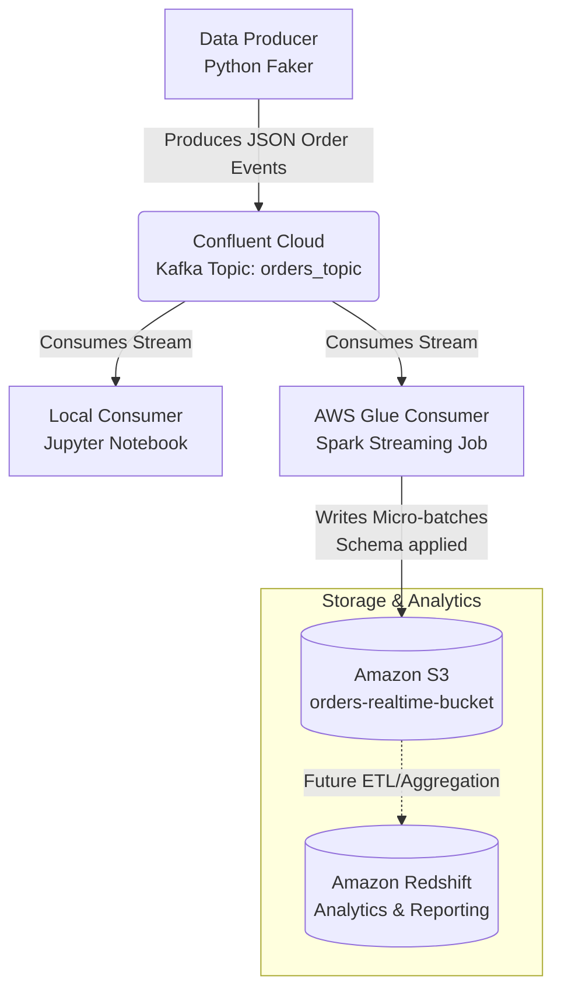

Project Components
1. Data Producer
A Python-based producer that generates synthetic order events continuously. The events simulate an e-commerce storefront and include details such as order_id, customer_id, product, quantity, price, and order_timestamp. These events are published in real-time to a managed Kafka cluster.

2. Managed Kafka Cluster (Confluent Cloud)
The pipeline utilizes Confluent Cloud as the fully managed Kafka service. A topic named orders_topic is provisioned to serve as the central message broker between the producer and various consumers.

3. Local Consumer (Python)
A Python consumer running in a local environment (via a Jupyter Notebook). It subscribes to the orders_topic and continuously polls for new messages, validating the data stream in real-time. This is primarily used for debugging and local validation.

4. Cloud Data Pipeline (AWS Glue & S3)
An AWS Glue job is configured to process the stream in the cloud:

Connection: Connects securely to the Confluent Kafka cluster.

Processing: Reads the streaming order events using a Spark cluster.

Schema Definition: Defines and applies a robust schema to the incoming JSON payloads.

Storage: Writes the processed events to an Amazon S3 bucket (orders-realtime-bucket) under the /demo-orders/ directory. The data is saved in Parquet format and is dynamically partitioned by order_date (e.g., order_date=2024-07-16).

Workflow Steps
Event Generation: The streaming_data_producer.ipynb script generates fake order JSON payloads and continuously publishes them to Confluent Cloud.

Message Brokering: Confluent Cloud receives the stream, maintaining partitions, replication, and offsets for the orders_topic.

Local Monitoring: The streaming_data_consumer.ipynb script runs locally to display the raw incoming messages, confirming successful transmission.

Cloud ETL & Data Lake Storage: The AWS Glue Interactive Notebook spins up a Spark cluster, consumes the latest events from the topic, transforms them into Spark DataFrames, and writes them out in micro-batches to the S3 bucket as structured, partitioned Parquet files.

Future Enhancements
The processed Parquet files stored in S3 serve as a foundational scalable Data Lake. Future iterations of this pipeline will involve processing these partitioned Parquet files to generate aggregated metrics and storing the refined data in Amazon Redshift for advanced analytics, dashboards, and reporting.

Prerequisites
To run this project, you will need:

Python 3.8+

Confluent Cloud Account (with configured API Keys and Bootstrap Server details)

AWS Account (IAM permissions for AWS Glue, S3, and Redshift)

Python Libraries: confluent-kafka, faker, pyspark (for local development/testing)
"""

file_path = "README.md"
with open(file_path, "w") as file:
file.write(markdown_content)

print(f"Successfully generated {file_path}")


```text?code_stdout&code_event_index=1
Successfully generated README.md

Your Markdown file is ready
MD icon
README
 MD 
Open

I have created a comprehensive README file based on the architecture and workflow detailed in the video. It includes:

A Mermaid.js architectural diagram illustrating the flow from the Python producer to Confluent Cloud, and outwards to the local and AWS Glue consumers.

Detailed breakdowns of the project components (Data Producer, Confluent Cloud, Local Consumer, and AWS Glue/S3).

Step-by-step workflow explanations and prerequisites for setting up the environment.


Gemini is AI and can make mistakes.

# Real-Time Kafka Streaming Pipeline: Confluent Cloud to AWS S3

This repository contains a real-time data streaming pipeline that processes order events using Confluent Cloud (Kafka), Python, AWS Glue, and Amazon S3. 

## Architecture Diagram



## Project Components

### 1. Data Producer
A Python-based producer that generates synthetic order events continuously. The events simulate an e-commerce storefront and include details such as `order_id`, `customer_id`, `product`, `quantity`, `price`, and `order_timestamp`. These events are published in real-time to a managed Kafka cluster.

### 2. Managed Kafka Cluster (Confluent Cloud)
The pipeline utilizes **Confluent Cloud** as the fully managed Kafka service. A topic named `orders_topic` is provisioned to serve as the central message broker between the producer and various consumers.

### 3. Local Consumer (Python)
A Python consumer running in a local environment (via a Jupyter Notebook). It subscribes to the `orders_topic` and continuously polls for new messages, validating the data stream in real-time. This is primarily used for debugging and local validation.

### 4. Cloud Data Pipeline (AWS Glue & S3)
An AWS Glue job is configured to process the stream in the cloud:
* **Connection:** Connects securely to the Confluent Kafka cluster.
* **Processing:** Reads the streaming order events using a Spark cluster.
* **Schema Definition:** Defines and applies a robust schema to the incoming JSON payloads.
* **Storage:** Writes the processed events to an Amazon S3 bucket (`orders-realtime-bucket`) under the `/demo-orders/` directory. The data is saved in **Parquet** format and is dynamically partitioned by `order_date` (e.g., `order_date=2024-07-16`).

## Workflow Steps

1. **Event Generation:** The `streaming_data_producer.ipynb` script generates fake order JSON payloads and continuously publishes them to Confluent Cloud.
2. **Message Brokering:** Confluent Cloud receives the stream, maintaining partitions, replication, and offsets for the `orders_topic`.
3. **Local Monitoring:** The `streaming_data_consumer.ipynb` script runs locally to display the raw incoming messages, confirming successful transmission.
4. **Cloud ETL & Data Lake Storage:** The AWS Glue Interactive Notebook spins up a Spark cluster, consumes the latest events from the topic, transforms them into Spark DataFrames, and writes them out in micro-batches to the S3 bucket as structured, partitioned Parquet files.

## Future Enhancements
The processed Parquet files stored in S3 serve as a foundational scalable Data Lake. Future iterations of this pipeline will involve processing these partitioned Parquet files to generate aggregated metrics and storing the refined data in **Amazon Redshift** for advanced analytics, dashboards, and reporting.

## Prerequisites
To run this project, you will need:
* **Python 3.8+**
* **Confluent Cloud Account** (with configured API Keys and Bootstrap Server details)
* **AWS Account** (IAM permissions for AWS Glue, S3, and Redshift)
* **Python Libraries:** `confluent-kafka`, `faker`, `pyspark` (for local development/testing)
README.md
Displaying README.md.
